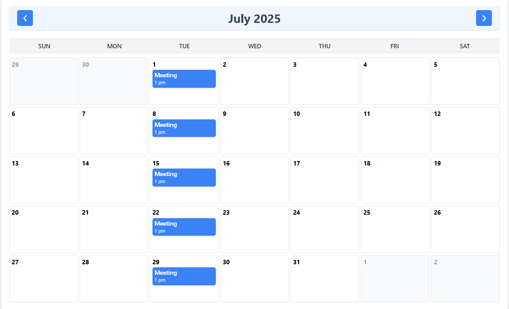
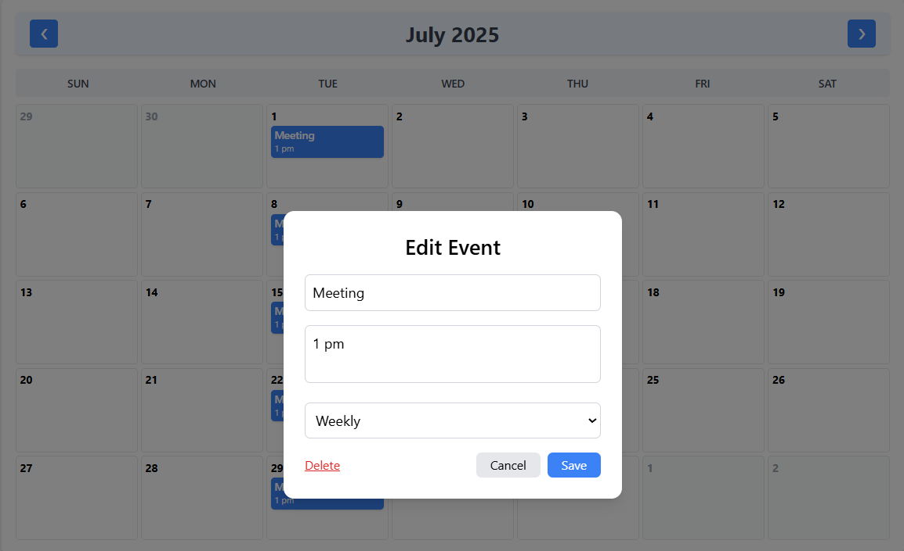

# 🗓️ Event Calendar with Recurring Events & Drag-and-Drop  

[](https://react.dev/)  
[](https://zustand-demo.pmnd.rs/)  
[](https://date-fns.org/)  
[](https://dndkit.com/)  
[](https://tailwindcss.com/)  

> A modern event calendar built with React featuring recurring events, drag-and-drop functionality, and responsive UI.  

---

## ✨ Features
- ✅ Monthly Calendar View with Navigation  
- ✅ Add, Edit, Delete Events  
- ✅ Recurring Events Support (Daily, Weekly, Monthly)  
- ✅ Drag & Drop Events to Reschedule  
- ✅ Responsive Design with Tailwind CSS  
- ✅ Clean Codebase & Easy Customization  

---

## 📂 Project Structure
```

## 🛠️ Getting Started  

### 1️⃣ Clone the Repository
```bash
git clone https://github.com/your-username/your-repo.git
cd your-repo
```

### 2️⃣ Install Dependencies  
```bash
npm install
```

### 3️⃣ Start the Development Server  
```bash
npm run dev
```
> Runs on: `http://localhost:5173`  

---

## 📋 Built With  
- **React 18+** — Frontend Library  
- **Zustand** — Lightweight State Management  
- **date-fns** — Date Utility Library  
- **@dnd-kit/core** — Drag and Drop Support  
- **Tailwind CSS** — Styling Framework  
- **Vite** — Fast Development Server  

---

## 📄 License  
This project is **open-source** and free for both personal and commercial use.  

---
## 📸 Project Preview




---

### 👨‍💻 Developed & Maintained by [Astitva Narayan Tiwari](https://github.com/astitvanarayan17)
